# 给细长的模型套环线

适合胳膊、手指、尾巴、软管。读进一个三角面高模，顺着最长的方向切成四边面环，还可以弯一下看关节。

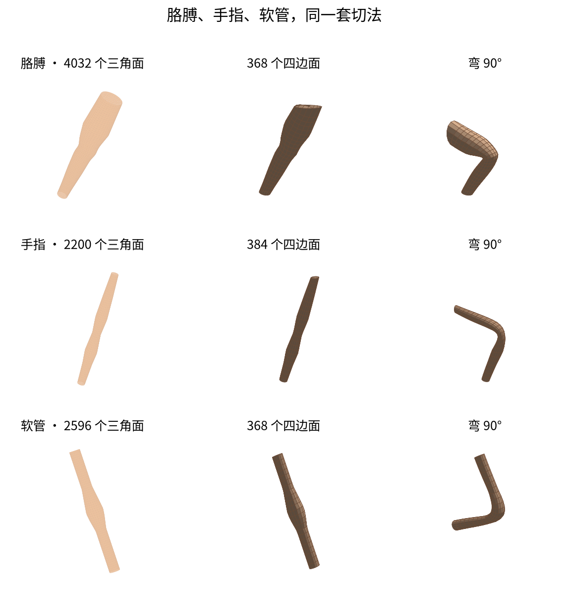

套完的边是一圈一圈绕过去的。

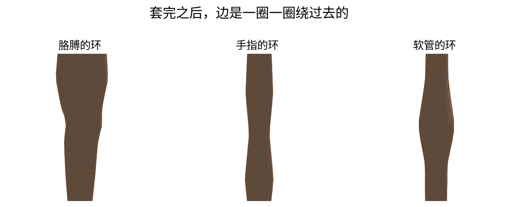

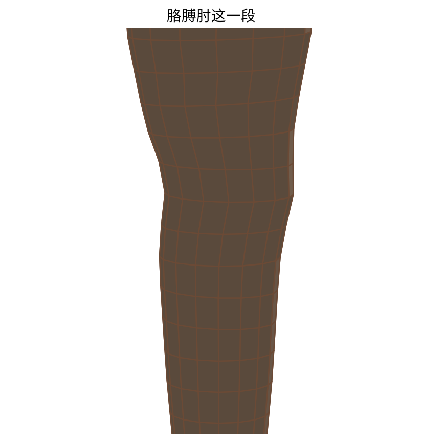

胳膊套完之后弯下去：

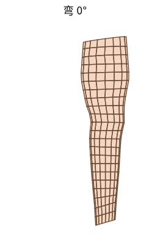

本来就是弯的，也能顺着弯套环，不会被切成直的。

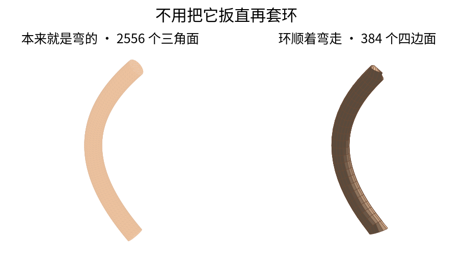

## 安装

```bash
git clone https://github.com/siddhartha-yz/deformation-aware-retopology.git
cd deformation-aware-retopology
python3 -m venv .venv
source .venv/bin/activate
pip install -r requirements-demo.txt
```

看图和套环线不用装 PyTorch。

## 跑内置的三个例子

```bash
python demo/tube_retopo.py --gallery
```

会写出：

| 文件 | 是什么 |
| --- | --- |
| `docs/figures/08_shapes.png` | 三种样子：高模、环线、弯 90° |
| `docs/figures/09_loops.png` | 环线特写 |
| `docs/figures/retopo_bend.gif` | 胳膊套完再弯 |
| `docs/figures/10_curved.png` | 本来就是弯的软管 |
| `docs/meshes/arm_sculpt.obj` `arm_rings.obj` `arm_bent.obj` | 胳膊 |
| `docs/meshes/finger_sculpt.obj` `finger_rings.obj` `finger_bent.obj` | 手指 |
| `docs/meshes/hose_sculpt.obj` `hose_rings.obj` `hose_bent.obj` | 软管 |

只要一条胳膊：

```bash
python demo/tube_retopo.py --demo
```

图在 `docs/figures/07_retopo.png`。

## 跑你自己的模型

OBJ 可以是三角面，也可以是四边面。

```bash
python demo/tube_retopo.py 你的模型.obj --rings 26 --around 16 --bend 90
```

结果写在模型旁边，不会盖掉仓库里的例子：

- `你的模型_preview.png` 高模、环线、弯一下
- `你的模型_bend.png` 0°、45°、90°、120°
- `你的模型_rings.obj`
- `你的模型_bent.obj`

内置胳膊的弯曲过程：

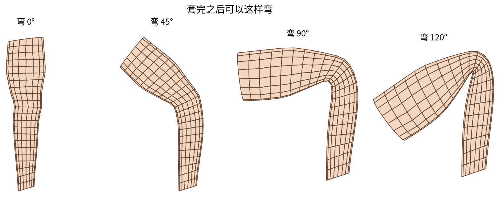

圈数和每圈点数按模型粗细改。太细的手指可以把 `--around` 降到 12。

不写方向时，顺着最长的那根切。身子旁边伸出一条胳膊，就会切到身子上。想要胳膊，告诉它方向：

```bash
python demo/tube_retopo.py 你的模型.obj --axis 1,0,0
```

`1,0,0` 是向右。向上用 `0,0,1`。

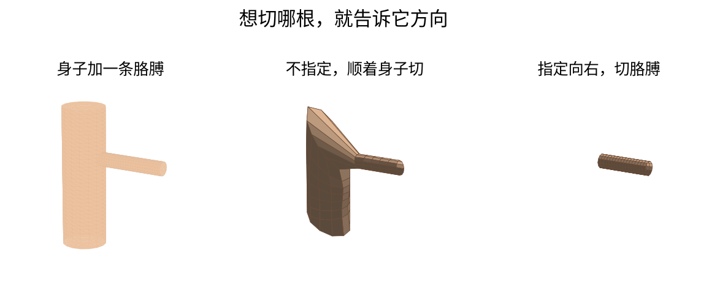

拉近看那条胳膊：

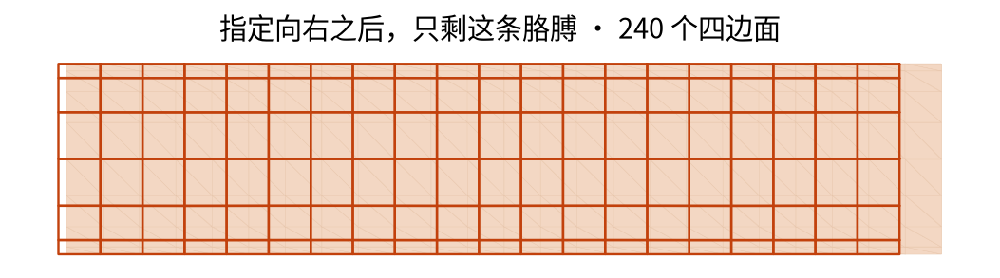

## 在 Blender 里

1. 安装 `release/retopo_flow_blender_addon_v1.0.0.zip`（和命令行是同一套切法）
2. 选中模型
3. 按 `N`，打开「环线」
4. 「切哪根」选自动，或选 X / Y / Z
5. 点「套上环线」

它沿着模型最长的方向切。分叉、整只手、身体切不好。

## 只看肘部怎么扁

这条和套环线是分开的。它用同一条胳膊比较横环和斜线，弯起来切面缩得一样多：90° 大约还剩 71%，120° 大约还剩一半。

```bash
python demo/armbend.py
```

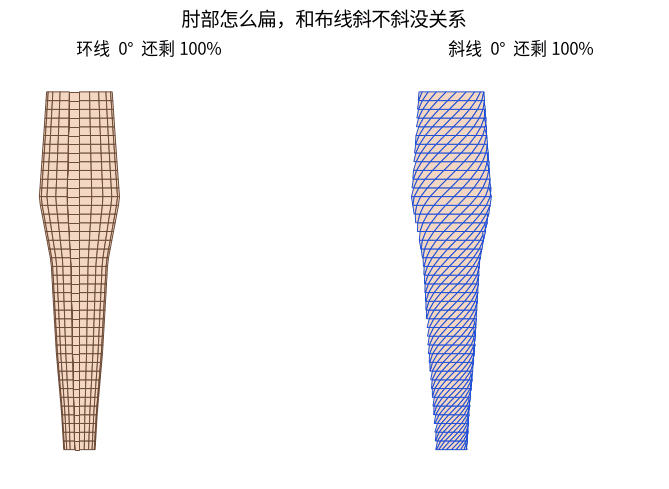

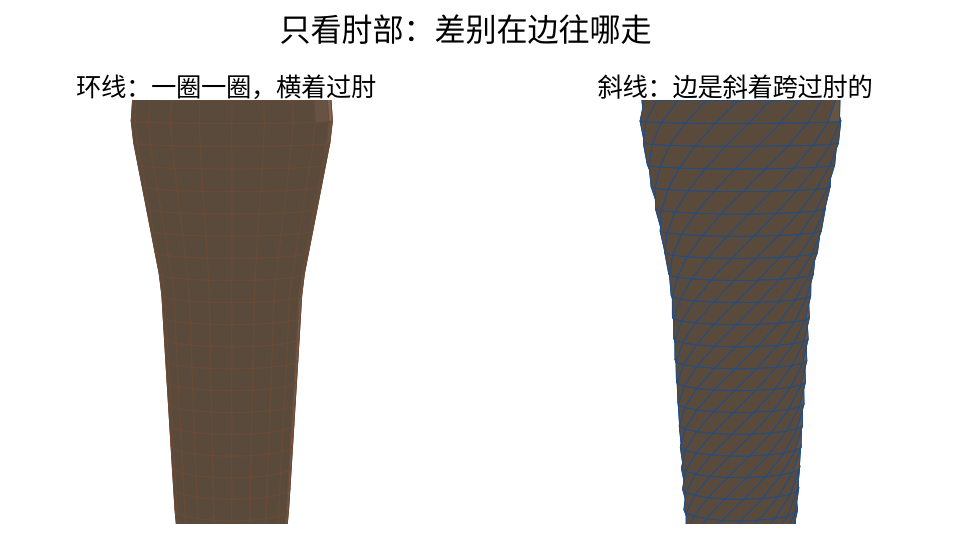

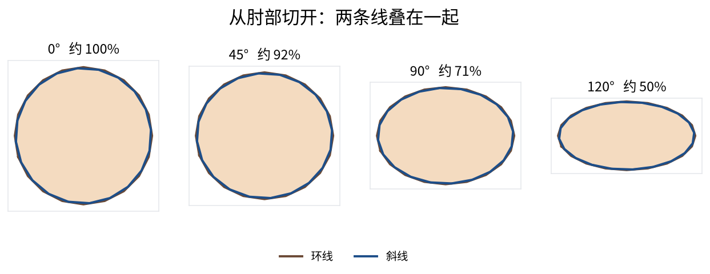
