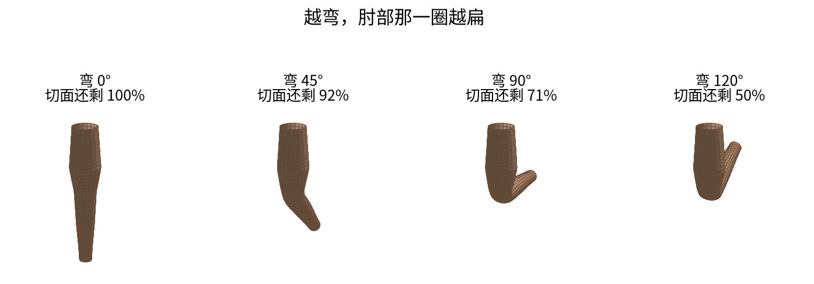
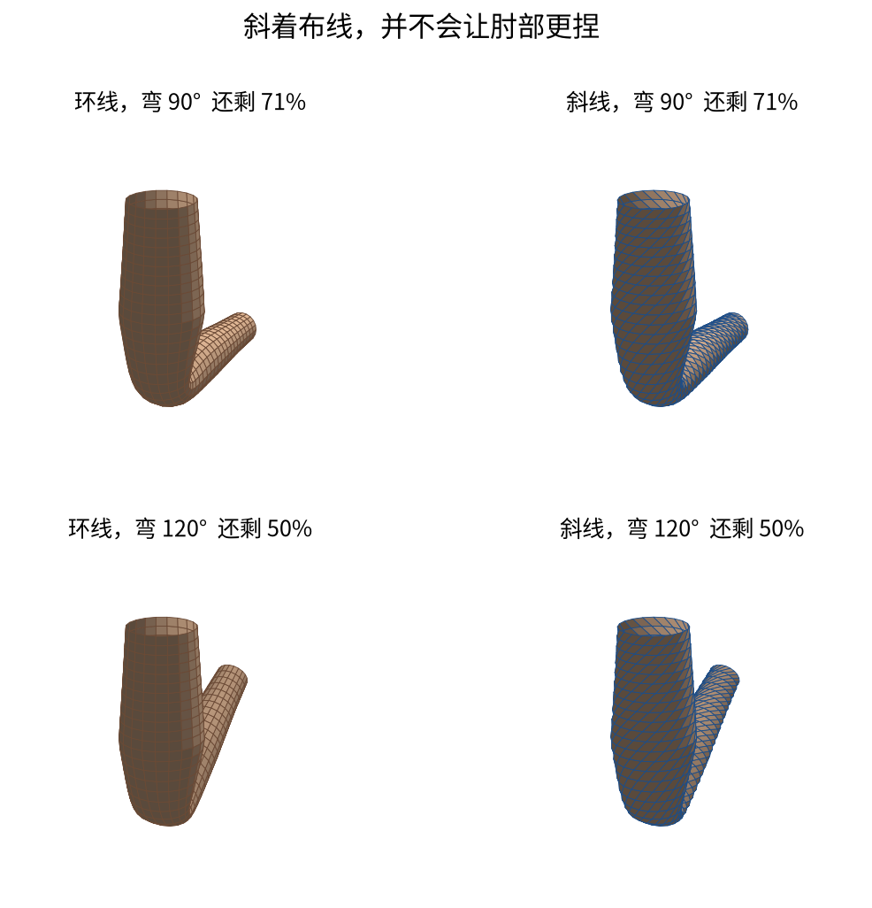
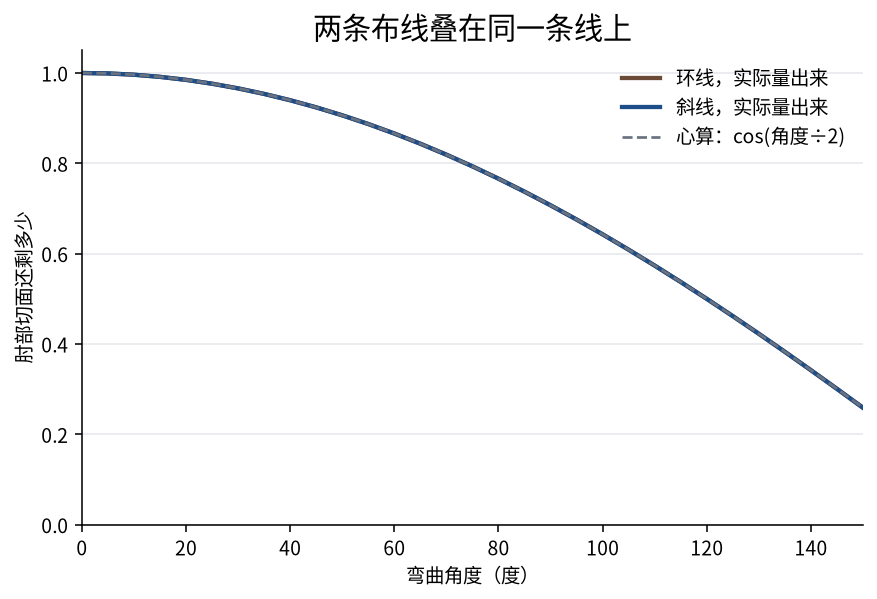
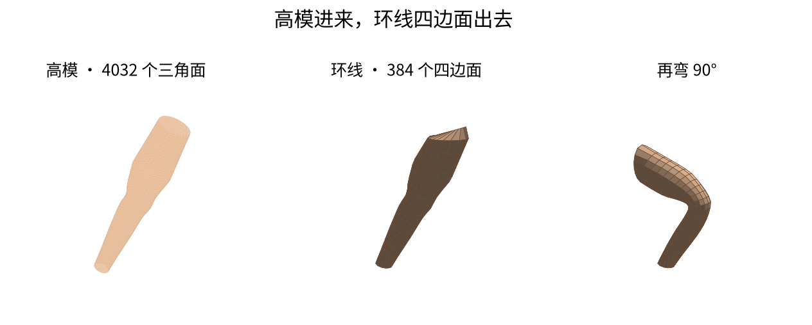
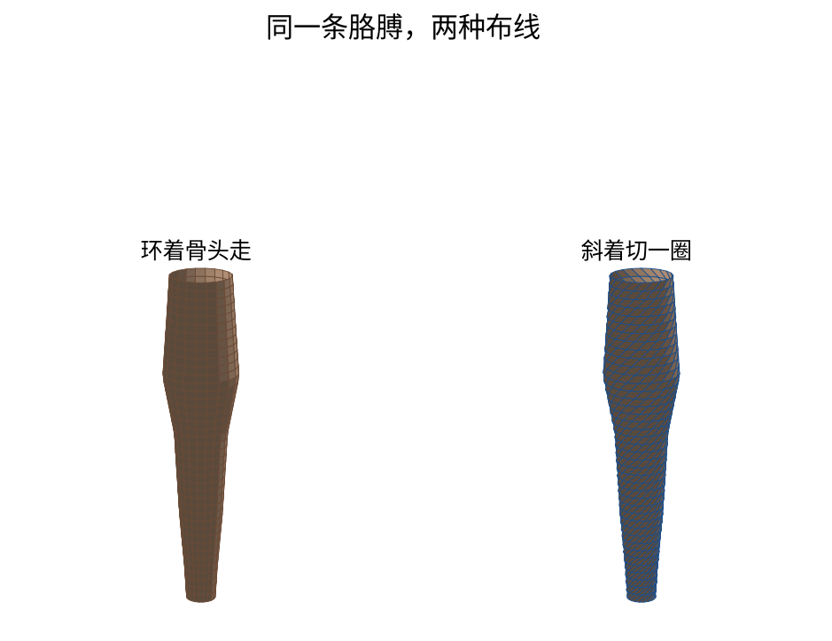

# 肘部弯了会扁成什么样

弯胳膊时，肘部那一圈会变扁。扁多少，跟线是横着绕还是斜着切，关系不大。

弯 90°，切面大约还剩 **71%**。弯 120°，大约还剩 **一半**。心算：`cos(弯的角度 ÷ 2)`。


这不是自动重拓扑工具，也没有训练好的模型。它画一条胳膊，让你看见关节切面怎么缩。

## 布线差在哪

横环是一圈一圈绕过肘部。斜线是边斜着跨过去。看上去差很多。


## 越弯越扁

下面是环线这一条。百分比是把肘部切开，量面积，再除以没弯时的面积。



## 两种布线弯到同一个数



切开之后，两条线叠在一起。




| 弯多少 | 切面大概还剩 |
| ---: | ---: |
| 30° | 96% |
| 45° | 92% |
| 90° | 71% |
| 120° | 50% |

这是两根骨头对半混在一起时的结果（线性混合蒙皮）。不是肌肉模拟，也不是布料。

## 自己跑

```bash
git clone https://github.com/siddhartha-yz/deformation-aware-retopology.git
cd deformation-aware-retopology
python3 -m venv .venv
source .venv/bin/activate
pip install -r requirements-demo.txt
python demo/armbend.py
```

图写到 `docs/figures/`。看图不需要装 PyTorch。

## 给自己的模型套环线

适合胳膊、手指、尾巴、软管这种细长的东西。先做成高模三角面，再：

```bash
python demo/tube_retopo.py 你的模型.obj --bend 90
```

没有现成模型就跑内置的一条胳膊：

```bash
python demo/tube_retopo.py --demo
python demo/tube_retopo.py --gallery
```

`--gallery` 会把胳膊、手指、软管各做一遍。




Blender 里也可以：装 `release/` 里的插件，选中模型，侧边栏「环线重拓扑」，点「套上环线」。它沿模型最长的方向切，不会再铺一个包围盒圆柱。

套完的模型在：

- `docs/meshes/sculpt_arm.obj` 高模
- `docs/meshes/retopo_rings.obj` 环线
- `docs/meshes/retopo_bent.obj` 弯 90°

前面那组对比用的是另外三份：`ring_0.obj`、`ring_90.obj`、`diagonal_90.obj`。

## 不要指望它做的事

- 分叉、带手指的身体切不好，它只适合一根管子
- 早期 README 里的对比分数不能用，说明在 [STATUS.md](STATUS.md)

静止时的整条胳膊：


